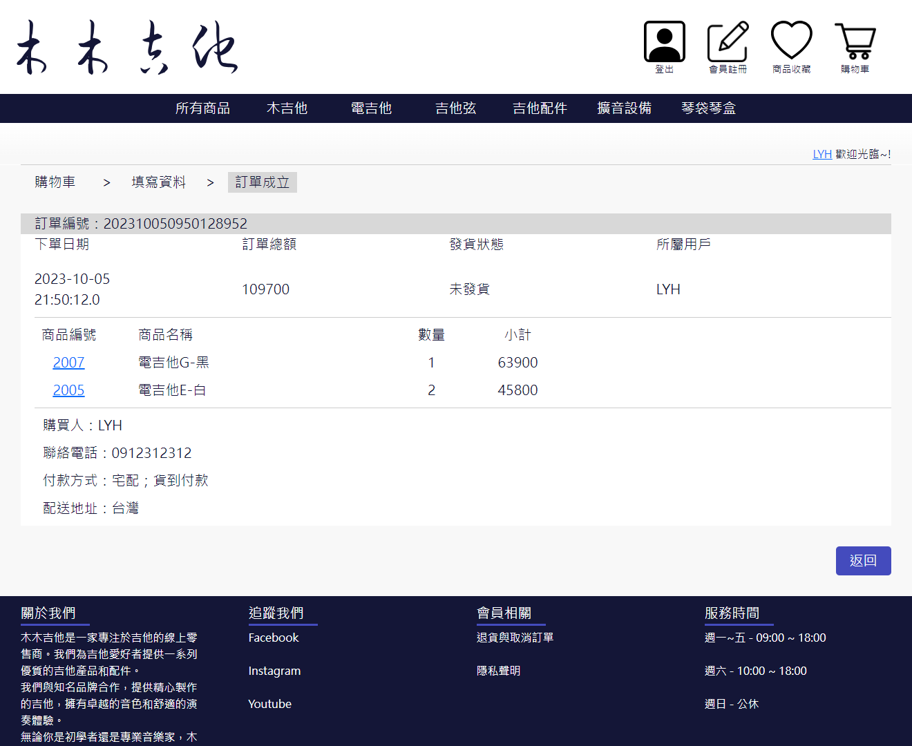

# 木木吉他 | 吉他購物網

[頁面截圖與功能說明](#頁面截圖與功能說明)

[專案用到的技術](#專案用到的技術)

[數據庫設計](#數據庫設計)

---

專案類型：電商網站 E-commerce website 
專案開始日期：2023 年 4 月 25 日 
※伺服器啟動後，發送 /index.do 請求即可訪問商品主頁。

網站名稱：木木吉他 ( mumu guitar ) 
網站主題：吉他與吉他周邊商品

## 頁面截圖與功能說明
一共有 13 個頁面，如下：

1. 商品主頁

  
  

- 展示所有販售的商品。
- 展示目前銷量前三名的熱門商品。
- 可根據商品分類、篩選條件和排序方式來尋找商品。
- 有分頁功能，每頁展示六項商品。
- 在登入會員的狀態下點擊 “愛心” 或 “購物車” 圖示可將商品添加到追蹤清單或購物車，再次點擊則移除。
  
2. 登入頁

  

  
- 登入會員。
- 帳號密碼驗證是否正確。
- 驗證碼功能。

3. 註冊頁

  

- 註冊會員。
- 帳號不可重複、聯絡電話僅為數字等驗證功能。
- 驗證碼功能。

4. 使用者資料頁

  

- 展示會員的個人資料。
- 修改個人資料功能。

5. 訂單列表頁

  

- 展示會員的所有訂單。
- 根據訂單編號搜尋訂單。
- 有分頁功能，每頁展示十筆訂單。

6. 訂單詳細訊息頁

  

- 展示訂單中的詳細訊息。

7. 商品詳細說明頁

  

- 展示商品的詳細訊息。
- 在登入會員的狀態下點擊 “加入收藏” 或 “加入購物車” 按鈕可將商品添加到追蹤清單或購物車，再次點擊則移除。

8. 商品收藏頁

  

- 展示會員收藏的所有商品。
- 展示目前銷量前三名的熱門商品。
- 可根據商品分類、篩選條件和排序方式來尋找商品。
- 有分頁功能，每頁展示六項商品。

9. 購物車頁

  

- 展示會員購物車中的所有商品。
- 自動計算商品小計、總金額與移除按鈕等功能。

10. 結帳頁

  

- 結帳時，展示該訂單中的商品、數量與金額等。
- 填寫購買人等相關資料。

11. 訂單管理頁

  

- 若登入者為管理員時，展示所有的訂單。
- 根據發貨的進度切換 “發貨狀態”。
- 根據訂單編號搜尋訂單。
- 有分頁功能，每頁展示十筆訂單。

  ※沒做取消訂單功能。

12. 會員管理頁

  

- 若登入者為管理員時，展示所有會員資料。
- 若會員違規，可切換會員帳號的使用狀態。
- 根據會員帳號搜尋會員。
- 有分頁功能，每頁展示十筆會員資料。

13. 商品管理頁

  

- 若登入者為管理員時，展示所有商品資料。
- 新增與修改商品功能。
- 切換商品的販售狀態。
- 根據商品編號搜尋商品。
- 有分頁功能，每頁展示十項商品。

## 專案用到的技術
前端：HTML、CSS、JavaScript、Bootstrap、Axios 
後端：Java、Thymeleaf 
資料庫：MySQL 
Web 伺服器：Tomcat 

## 數據庫設計

  

