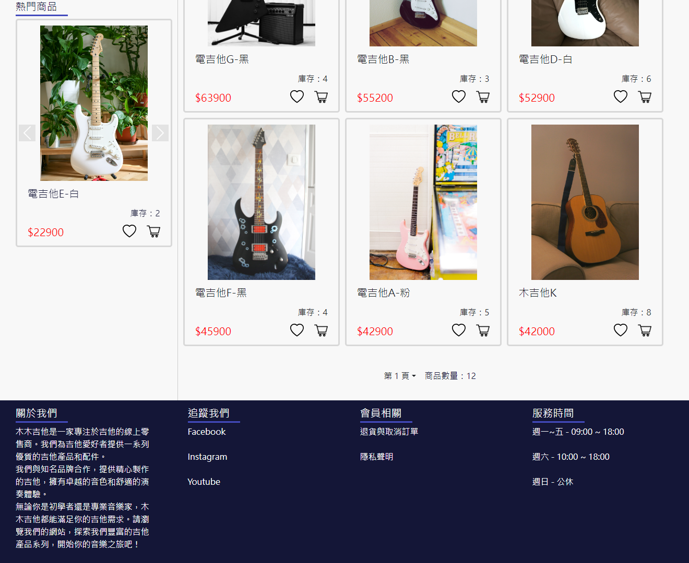

# 木木吉他 ( MuMu guitar )

  

[關於](#關於)

[頁面與功能](#頁面與功能)

[數據庫設計](#數據庫設計)

[用到的技術](#用到的技術)

---

# 關於

木木吉他 ( MuMu guitar ) 是一個販售吉他及其週邊產品的電商網站，它可以讓買家透過商品分類、價格、名稱等篩選方式，方便快速的找到自己想要的商品。看到喜歡的商品也可以添加到 ”商品收藏” 中，方便買家在未來可以更快地找到該商品，而 “購物車” 功能可以讓買家將多個商品一起放入購物車中，結帳時將製成一張訂單給賣家進行後續的處理與發貨。賣家則可以使用該網站來對會員、商品和訂單等進行管理。

GitHub：[mumu_guitar](https://github.com/LYH-94/mumu_guitar)

UI 設計：[MuMu guitar](https://www.figma.com/design/cb58OeimG6CF2uZLy9faNW/E-commerce-website?node-id=0-1&t=Ni6ESHiDjQv5NcCY-1) - 第一次使用 Figma 也是第一次設計前端頁面，因此有許多細節沒有注意到，在切板時也並未完全按照設計圖。

Demo - http://linyaohua.ddns.net:8080/mumu_guitar/index.do

測試帳號
* 一般用戶 - 帳：user001 密：pwd001
* 管理員 - 帳：root 密：abc123

# 頁面與功能

一共有 13 個頁面，如下：

1. 商品主頁

  
  

- 展示所有販售的商品。
- 展示目前銷量前三名的熱門商品。
- 可根據商品分類、篩選條件和排序方式來尋找商品。
- 有分頁功能，每頁展示六項商品。
- 在登入會員的狀態下點擊 “愛心” 或 “購物車” 圖示可將商品添加到追蹤清單或購物車，再次點擊則移除。

2. 登入頁

  

- 登入會員。
- 帳號密碼驗證是否正確。
- 驗證碼功能。

3. 註冊頁

  

- 註冊會員。
- 帳號不可重複、聯絡電話僅為數字等驗證功能。
- 驗證碼功能。

4. 使用者資料頁

  

- 展示會員的個人資料。
- 修改個人資料功能。

5. 訂單列表頁

  

- 展示會員的所有訂單。
- 根據訂單編號搜尋訂單。
- 有分頁功能，每頁展示十筆訂單。

6. 訂單詳細訊息頁

  

- 展示訂單中的詳細訊息。

7. 商品詳細說明頁

  

- 展示商品的詳細訊息。
- 在登入會員的狀態下點擊 “加入收藏” 或 “加入購物車” 按鈕可將商品添加到追蹤清單或購物車，再次點擊則移除。

8. 商品收藏頁

  

- 展示會員收藏的所有商品。
- 展示目前銷量前三名的熱門商品。
- 可根據商品分類、篩選條件和排序方式來尋找商品。
- 有分頁功能，每頁展示六項商品。

9. 購物車頁

  

- 展示會員購物車中的所有商品。
- 自動計算商品小計、總金額與移除按鈕等功能。

10. 結帳頁

  

- 結帳時，展示該訂單中的商品、數量與金額等。
- 填寫購買人等相關資料。

11. 訂單管理頁

  

- 若登入者為管理員時，展示所有的訂單。
- 根據發貨的進度切換 “發貨狀態”。
- 根據訂單編號搜尋訂單。
- 有分頁功能，每頁展示十筆訂單。
※沒做取消訂單功能。

12. 會員管理頁

  

- 若登入者為管理員時，展示所有會員資料。
- 若會員違規，可切換會員帳號的使用狀態。
- 根據會員帳號搜尋會員。
- 有分頁功能，每頁展示十筆會員資料。

13. 商品管理頁

  

- 若登入者為管理員時，展示所有商品資料。
- 新增與修改商品功能。
- 切換商品的販售狀態。
- 根據商品編號搜尋商品。
- 有分頁功能，每頁展示十項商品。

# 數據庫設計

1. 抽取實體 ( 應與數據表對應 ) 並分析其中的屬性
   * 用戶 - User  
     帳號、密碼、姓名、性別、生日、聯絡電話、電子信箱、用戶狀態
   * 商品 - Product  
     商品圖片、商品名稱、商品說明、價格、品牌、型號、庫存、銷量
   * 訂單 - Order  
     訂單編號、下單日期、訂單總額、發貨狀態、所屬用戶、商品、購買人、聯絡電話、付款方式、配送地址
   * 訂單商品 - OrderProduct  
     商品、數量、所屬訂單、小計
   * 商品收藏 - Favorite  
     商品、所屬用戶
   * 購物車 - Trolley  
     商品、數量、所屬用戶
     ( 後端開發中還要有一個 “購物車類”，這個類並不和數據表進行對應。 )
2. 分析實體之間的關係
   * 用戶：訂單 ⇒ 1：n
   * 用戶：訂單 ⇒ 1：n
   * 用戶：購物車 ⇒ 1：n
   * 用戶：商品收藏 ⇒ 1：n
   * 訂單：商品 ⇒ 1：n
   * 購物車：商品 ⇒ 1：1
   * 商品收藏：商品 ⇒ 1：1
   * 訂單：訂單商品 ⇒ 1：n
   * 商品：訂單商品 ⇒ 1：n

  

# 用到的技術

前端：HTML、CSS、JavaScript、Bootstrap、Axios 
後端：Java、Thymeleaf 
資料庫：MySQL 
Web 伺服器：Tomcat 
